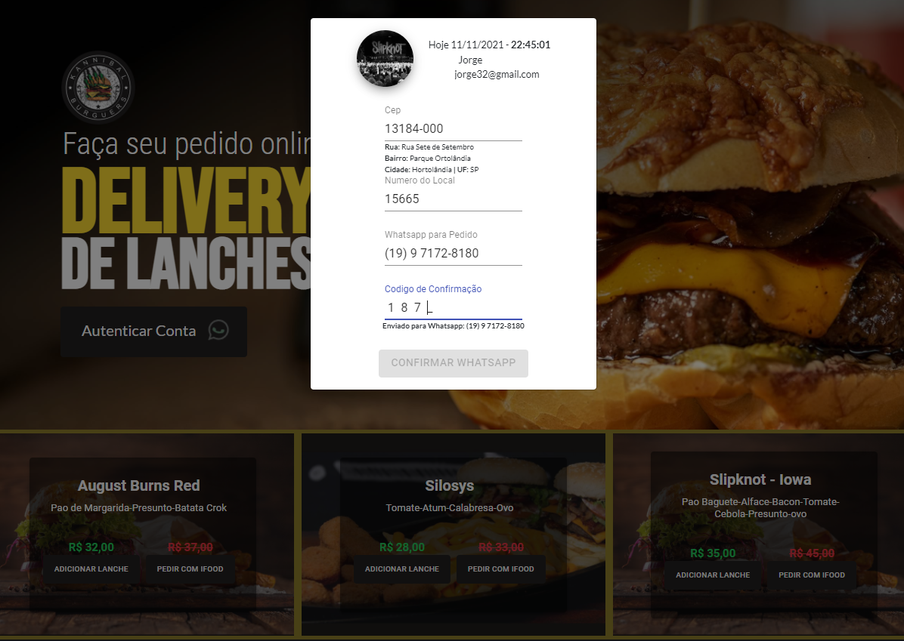

# Prototipo de Cardapio Online - Em Desenvolvimento

### Versão Funcional

Pode ser acessado no link [Projeto Build](https://app-burgues.gbyteinfo.com.br).
ATENÇÃO - "Alguns segundos para ligar e carregar os Lanches"

## Tecnologias Utilizadas

Descrição:

### `Client`

Desenvolvido com React JS;

Build rodando em uma VM Dedicada com Cpanel;

Disponivel versão em desenvolvimento em [Burgues Cardapio Online](https://github.com/gbyteinfo/Burgues-Cardapio-Online)

### `Server`

Desenvolvido com SpringBoot e SpringData(Font não publicado ainda);

Base de Dados relacional Mysql, add-on JawsDB MySQLe;

Deploy e disponivel na VM Cloud Heroku;

### `Descrição Motivação`

em breve ...

### `Funcional`

Em breve ...

### `npm run build`

Não esta diponivel algumas classes relacionadas as requisições na API do Spring;

Tambem não tem o Id do client google;

### `Copyright`

Código disponivel para estudo e disponibilidade de conhecimento.

### `Nota do Desenvolvedor`

Minha escolha por essa profissão se da pela minha paixão pelo desenvolvimento;

Espero que esse projeto consiga ajudar de alguma maneira a comunidade;

Fique a vontade para sujerir melhorias ou Merge Request;